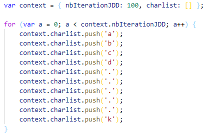
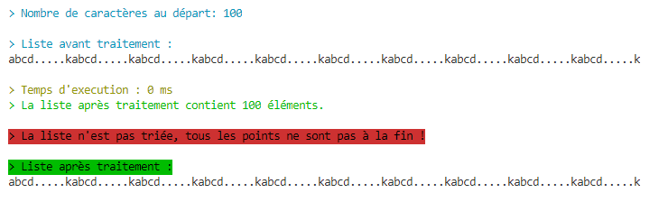

# exo-pushdot

**#training #javascript #list #array #sort #algo**

Voici un entrainement permettant de faire travailler son cerveau et découvrir des choses (je l'espère) en trois petits exercices assez simple.

### **Pré-requis**

Le code est en **Javascript**, il vous faudra quelquechose pour exécuter du Javascript.

Personnelement j'utilise la dernière version de **[NodeJs](https://nodejs.org/en/)**

## **L'objectif**

**Contexte**: J'ai une liste qui contient des caractères et des points dans le désordre. L'objectif est de faire en sorte que tous les points de cette liste **se retrouvent à la fin !** Facile n'est-ce pas ?

**Exemple**

-   Au départ ma liste ressemble à : **abcd.....k**
-   Après le tri, elle doit ressembler à : **abcdk.....**

**Durée**: Vous avez **20 minutes** pour réaliser les 3 exercices.

_A vous d'être fair-play, si vous ne réussissez pas dans les temps, supprimez votre code et recommencez. **Ce n'est pas obligatoire**, mais cela est beaucoup plus motivant !_

### **La génération du jeu de données**

Il y a un objet **'context'** qui contient deux propriétés :

-   **nbIterationJDD :** Un entier correspondant au nombre de fois que l'on souhaite ajouter le jeu de donnée de base.
-   **charlist :** La liste contenant le jeu de donnée qui sera généré.

En fonction de la valeur de **nbIterationJDD**, une boucle **for** va se charger de remplir l'array **charlist** autant de fois que demandé avec la valeur de base qui est : **['a', 'b', 'c', 'd', '.', '.', '.', '.', '.', 'k']**

Vous n'avez rien à faire avec cela, si ce n'est changer la valeur de **nbIterationJDD** si vous voulez augmenter la liste de base. Cela vous servira nottament pour **l'exercice n°3.**

Suite à la génération, c'est la méthode **pushdot(context)** qui est appelée, c'est celle-ci que vous aurez à implémenter pour réaliser les exercices.

### **L'exécution**

Si vous avez le même pré-requis que moi, à savoir **NodeJS**, vous pouvez exécuter l'exercice avec la commande:

> **node** exo_pushdot.js

Pour ma part j'ai installé **nodemon** en global afin de relancer l'exercice à la sauvegarde.

> npm install -g **nodemon**

> **nodemon** exo_pushdot.js

Voici ce que vous devriez obtenir à la première exécution:

**A noter :** Au dessus de **1000 itérations**, la console n'affiche plus la liste pour des raisons de performance de votre machine.

### **1 - Dans un premier**

Dans un premier temps, vous devez simplement remplir l'objectif de départ, **faire en sorte que tous les points de la liste de caractères de départ se retrouvent à la fin !**

| Avant      | Après      |
| ---------- | ---------- |
| abcd.....k | abcdk..... |

**Ah oui ! J'allais oublier !** Vous avez tout de même des petites contraintes:

-   Vous ne devez utiliser que de **'for'** et de **'if'**
-   Vous n'avez pas le droit de créer d'autres listes tampon, il faut travailler sur la liste passer en paramètre dans l'objet **context**.

Vous avez le droit d'utiliser le **splice** et le **push** pour supprimer des éléments et en ajouter.

**C'est à vous de jouer !**

### **2 - On corse l'exercice**

Si vous n'avez pas déjà anticipé cet exercice, on ajoute une toute petite règle à l'exercice 1, il faut utiliser la méthode **'pushdot'** de manière **récursive !**

**Let's GO !**

### **3 - Open bar**

**Enfin la libération !** Vous faites comme vous le sentez pour mettre les points à la fin, plus de contrainte de **'for'** et de **'if'**, la seule contrainte ici sera la recherche de la **performance !**

Pour cela il faut changer la variable **nbIterationJDD** de l'objet context pour avoir **50 millions** de caractères:

> var context = { nbIterationJDD: 5000000, charlist: [] };

Pour vous donner un ordre d'idée, sur mon poste j'avoisine les **3,3 secondes** pour **50 000 000** de caractères.

**Amusez vous !**
